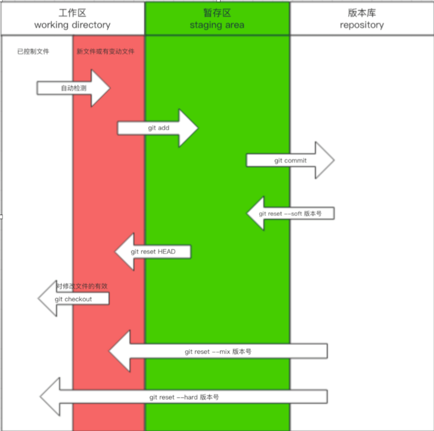
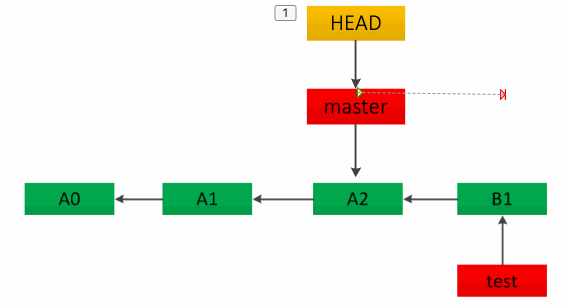
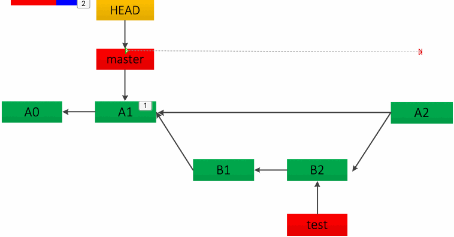
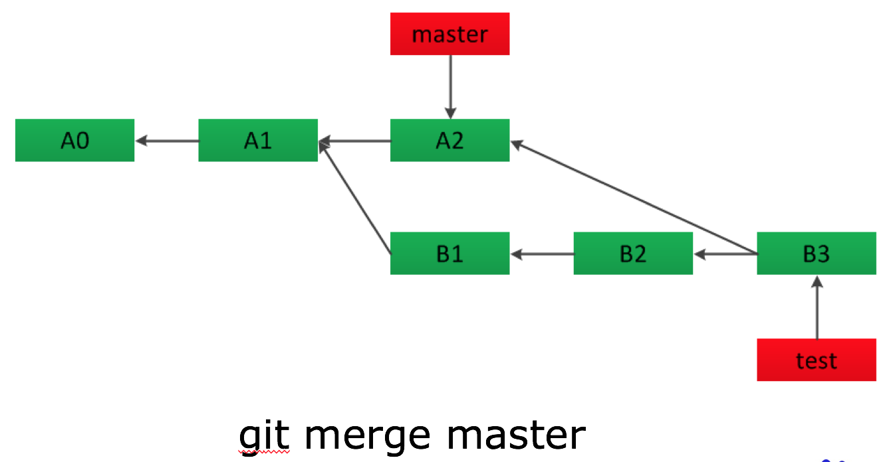
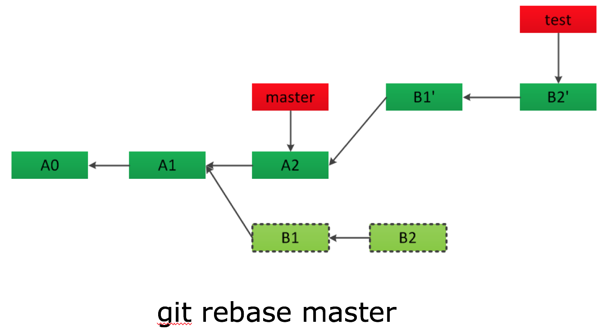

# git学习笔记

## git基础知识

### 概述

#### 仓库初始化
1. 初始化  
在工作目录下执行`git init`生成git仓库，之后工作目录下任何的更改都将被git追踪。
2. git配置  
- git的配置分为仓库级、用户级和系统级三个级别，配置文件分别为`.git/config`、`~/.gitconfig`、`git安装目录/etc/gitconfig`。  
- 执行`git config [--local/--global/--system] <section.key> <value>`设置各级配置项，例如`user.name`、`user.email`。  
- 执行`git config [--local/--global/--system] -l`查看各级配置信息。  

#### 本地仓库三区
为了使文件的更改更灵活，git采用了三区流转的方式，可以通过`git status`命令可以查看不同阶段的文件状态。  
1. 工作区workspace  
- 程序文件所在的目录。工作区中的文件的任何更改都会被git跟踪到，可以在`.gitignore`文件中规定哪些文件不必跟踪。  
- 更改后未暂存，想撤销更改回到上次提交后的状态，执行`git checkout -- <file-name>`。  
2. 暂存区stage/index  
- 文件更改后执行`git add .`命令便将更改暂存到暂存区。  
- 执行`git reset HEAD [<file-name>]`将暂存的更改撤销，工作区保留更改。  
3. 版本库repository  
- 执行`git commit -m "<message>"`命令将暂存区的更改提交到版本库，产生一次提交记录，暂存区重新变"干净"。  
- 执行`git reset --hard <commit-id>`命令使三个区域都回退到对应`commit-id`这次提交后的状态。  

#### 分支
- 为了便于多人协作，git提供了分支功能。每一个团队成员都可以根据要实现的功能创建不同的分支进行独立开发，开发完成后再合并到主分支。  
- 执行`git branch <branch-name>`创建分支，创建完成后执行`git checkout <branch-name>`切换到刚创建的分支，也可以通过`git checkout -b <branch-name>`将以上两步一起执行。  
- 切换分支之前如果当前分支有更改未提交，可以执行`git stash [save "<save message>"]`将当前的更改存储，处理完其他分支的工作之后再执行`git stash pop [stash@{0,1,..}]`恢复工作区和暂存区。  
- 执行`git branchname [-r/-a]`可以查看本地、远程或所有分支，其中前面带`*`的是当前分支。  
- 每一个分支独立执行三区的操作，有独立的更改记录文件，所以特别适合协同开发。  
- 执行`git merge [--no-ff/--squash] <brach-name>`可以将`brach-name`分支合并到当前分支，不同的参数提供了不同的合并策略；如果合并之前执行`git rebase`可以保证合并之后当前分支不分叉。 
  - 默认合并方式fast-forward  
  
  - no-ff模式
 
  - squash模式  
  
  - rebase模式  
 

#### 标签
- 标签可以理解为提交记录的别名，通过`git tag -a <tag-name> -m "<message>" commit-id`为某次提交记录添加标签。  
- 添加标签之后，许多命令中的`commit-id`可以用`tag-name`替换。  

#### 远程仓库
- 远程仓库与本地类似，只不过仓库和文件存放在远程服务器上。  
- 在github、gitee等网站创建远程仓库之后，执行`git remote add <origin-name> <origin-url>`命令建立本地仓库与远程仓库之间的联系。添加完成后可通过`git remote [-v]`查看远程仓库信息。  
- 执行`git clone [-b <branch-name>] <origin-url> [<workspace-name>]`可以将远程仓库`branch-name`分支的内容复制到本地的`workspace-name`目录下。  
- 执行`git pull [<origin-name> <remote-branch-name>:<local-branch-name>]`可以将远程仓库`remote-branch-name`分支拉到本地，并合并到本地仓库的`local-branch-name`分支。  
- 执行`git push [<origin-name> <local-branch-name>:<remote-branch-name>]`可以将本地仓库的`local-branch-name`推到远程，并合并到远程仓库的`remote-branch-name`分支。  

#### 版本指针
git的结构像是由提交记录组成的数据链，每一个提交记录像是链条上的一个节点，每一个节点都有对应的HASH值id，同时git也提供了以下几个指针方便使用。
- `HEAD`：无论切换到哪个分支，执行何种操作始终指向当前分支的最近一次提交节点。`HEAD^`表示上一个提交节点，`HEAD^^`表示上两个提交节点，`HEAD~5`表示前溯5个提交节点。
- `master`、`dev`：大部分情况下指向所在分支的最近一次提交节点，但当使用`git rebase [<start-point>] [<end-point>] --onto [<branch-name>]`将提交应用到分支时会处于HEAD游离状态，该指针仍指向指令执行前的节点。需要执行`git reset <end-point>`将该指针与HEAD保持一致。
- `tag-name`：指向绑定的提交节点。

### 推荐工作流程
1. 在github、gitee等网站创建仓库并初始化；  
2. 将远程仓库克隆到本地；  
3. 根据需求创建dev、feature、bug等分支，在分支上进行开发、暂存、提交、合并；  
4. 将本地分支推送到远程仓库对应分支。

## git常用命令清单